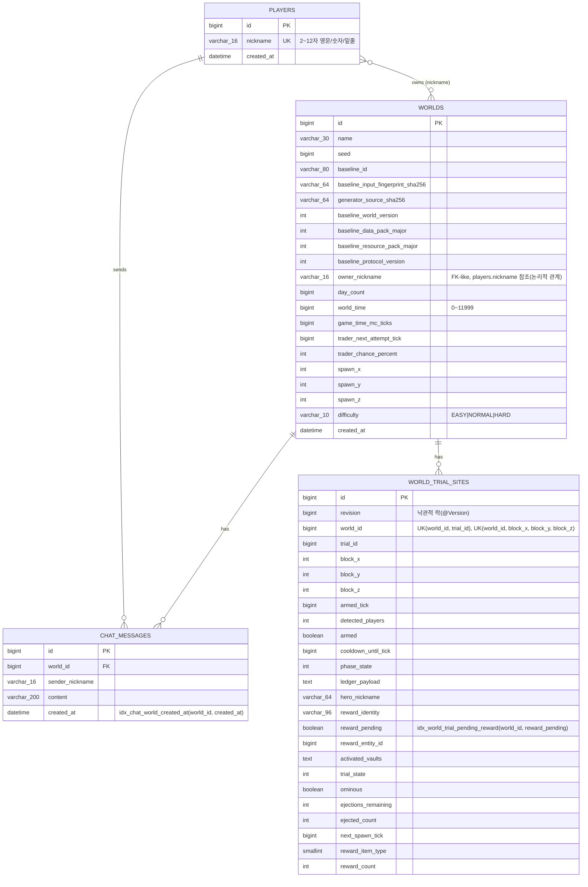

# Game Spring Expert Assignment (WebCraft)

## 실행 방법

```bash
docker compose up -d
```

`app-server-1`(8080), `app-server-2`(8081) 두 인스턴스가 동일한 MySQL/Redis를 공유하는 멀티 서버 구조로 기동됩니다.

---

## ERD



> `owner_nickname`, `sender_nickname`은 실제 FK 제약이 아니라 `players.nickname`을 참조하는 애플리케이션 레벨 관계입니다.
> `world_id`가 다른 월드를 가리키는 "차원(dimension)" 개념이 있어 하나의 오버월드에 하위 월드가 연결될 수 있습니다(`WorldRepository.isDimensionChild`).

---

## REST API 명세

Base URL: `http://localhost:8080`

### 플레이어

| Method | URI | 설명 | 요청 Body | 성공 응답 |
|---|---|---|---|---|
| POST | `/players` | 플레이어(닉네임) 등록 | `{ "nickname": "string" }` (2~12자, 영문/숫자/`_`) | `201 Created` (본문 없음) |

### 월드

| Method | URI | 설명 | 요청 | 성공 응답 |
|---|---|---|---|---|
| GET | `/worlds` | 월드 목록 조회 (접속자 수 포함) | - | `200 OK` `WorldSummaryResponse[]` |
| POST | `/worlds` | 월드 생성 | Body: `{ "name": "string(1~30)", "difficulty": "EASY\|NORMAL\|HARD", "nickname": "string(2~12)", "debugSeed": "number(optional)" }` | `201 Created` `CreatedWorldResponse` |
| DELETE | `/worlds/{id}` | 월드 삭제 | Query: `nickname` (소유자 검증용, optional) | `204 No Content` |
| DELETE | `/worlds/{id}/if-matches` | 조건부 월드 삭제 (낙관적 삭제) | Query: `nickname`(optional), Body: `{ "name", "seed", "difficulty", "ownerNickname" }` 전체 일치 시에만 삭제 | `204 No Content` |

**WorldSummaryResponse**

```json
{ "id": 1, "name": "MyWorld", "seed": 123456, "onlineCount": 3, "difficulty": "NORMAL" }
```

**CreatedWorldResponse**

```json
{ "id": 1, "name": "MyWorld", "seed": 123456, "difficulty": "NORMAL", "ownerNickname": "steve" }
```

### 채팅

| Method | URI | 설명 | 요청 | 성공 응답 |
|---|---|---|---|---|
| GET | `/worlds/{worldId}/chats` | 최근 채팅 N건 조회 (Redis 캐시 우선) | Query: `limit`(default 50) | `200 OK` `ChatMessageResponse[]` |
| GET | `/worlds/{worldId}/chats/history` | 커서 기반 채팅 히스토리 페이지 조회 | Query: `beforeCreatedAt`(ISO DateTime, optional), `beforeId`(optional), `limit`(default 20) | `200 OK` `ChatHistoryPage` |

**ChatMessageResponse**

```json
{ "sender": "steve", "content": "hello", "createdAt": "2026-09-22T10:00:00" }
```

**ChatHistoryPage**

```json
{
  "items": [ { "id": 10, "sender": "steve", "content": "hello", "createdAt": "2026-09-22T10:00:00" } ],
  "hasNext": true,
  "nextCreatedAt": "2026-09-22T09:59:00",
  "nextId": 9
}
```

### 오류 응답

모든 예외는 아래 형식의 공통 응답으로 변환됩니다.

```json
{ "error": "VALIDATION_FAILED" }
```

| Status | error 코드 예시 |
|---|---|
| 400 | `VALIDATION_FAILED`, `INVALID_REQUEST_BODY` |
| 404 | `NOT_FOUND` (도메인별 상세 코드 포함) |
| 403 | 도메인별 권한 오류 코드 |
| 409 | 도메인별 충돌 오류 코드 |
| 503 | 도메인별 서비스 불가 코드 |
| 500 | `INTERNAL_ERROR` |

---

## WebSocket 프로토콜

`ws://localhost:8080/ws/worlds/{worldId}?nickname={nickname}` 로 접속합니다. 핸드셰이크 시 `nickname`이 등록된 플레이어인지, `worldId`가 존재하는(오버월드) 월드인지 검증하며 실패 시 각각 `4000`, `4001` 코드로 연결을 종료합니다.

연결 후에는 `{"type": "..."}` 형태의 JSON 메시지를 주고받습니다.

| type (요청) | 방향 | 필드 | 설명 |
|---|---|---|---|
| `move` | Client → Server | `x, y, z, yaw, pitch, crouching, gliding, finalSceneActionId?` | 플레이어 이동 액션을 엔진 큐에 전달 |
| `chat` | Client → Server | `content` (1~200자) | 채팅 전송. Redis Lua 스크립트로 10초당 5회 제한(`CHAT_COOLDOWN`) |
| `ping` | Client → Server | - | 접속 유지(heartbeat), 응답으로 `pong` 전송 |
| `onlineUsers` | Client → Server | - | 현재 월드 접속자 목록 요청 |

| type (응답) | 필드 | 설명 |
|---|---|---|
| `chat` | `sender, content, timestamp` | 저장된 채팅을 월드 내 전체에 브로드캐스트 |
| `pong` | - | `ping`에 대한 응답 |
| `onlineUsers` | `users[], count` | 요청자에게만 전송되는 접속자 목록 |
| `error` | `code` | 잘못된 메시지(`INVALID_JSON`, `UNKNOWN_TYPE`, `INVALID_MESSAGE`, `QUEUE_FULL`, `CHAT_COOLDOWN`, `INTERNAL_ERROR`) |

### `move`

Request (Client → Server)

```json
{
  "type": "move",
  "x": 12.5,
  "y": 64.0,
  "z": -3.2,
  "yaw": 90.0,
  "pitch": 0.0,
  "crouching": false,
  "gliding": false,
  "finalSceneActionId": null
}
```

별도 응답 없음 (엔진 큐에 반영되어 다른 클라이언트에는 엔진 상태 브로드캐스트로 반영됩니다).

### `chat`

Request (Client → Server)

```json
{
  "type": "chat",
  "content": "hello world"
}
```

Response (Server → World 전체 브로드캐스트)

```json
{
  "type": "chat",
  "sender": "steve",
  "content": "hello world",
  "timestamp": "2026-09-22T10:00:00"
}
```

Response (레이트리밋 초과 시, 요청자에게만)

```json
{ "type": "error", "code": "CHAT_COOLDOWN" }
```

### `ping`

Request (Client → Server)

```json
{ "type": "ping" }
```

Response (Server → 요청자)

```json
{ "type": "pong" }
```

### `onlineUsers`

Request (Client → Server)

```json
{ "type": "onlineUsers" }
```

Response (Server → 요청자)

```json
{
  "type": "onlineUsers",
  "users": ["alex", "steve"],
  "count": 2
}
```

### `error`

메시지 파싱/처리 실패 시 요청자에게만 전송됩니다.

```json
{ "type": "error", "code": "UNKNOWN_TYPE" }
```
